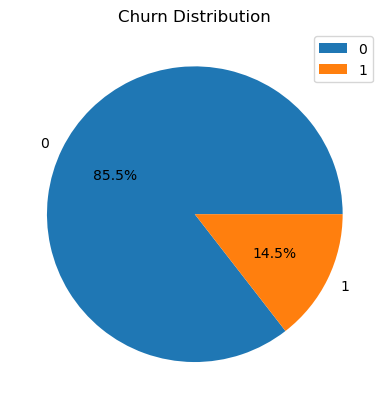
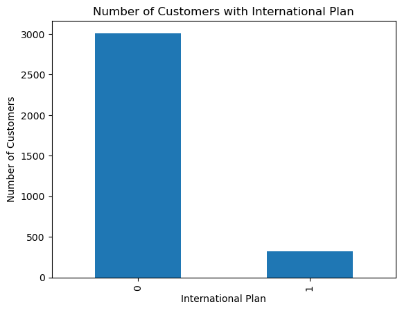
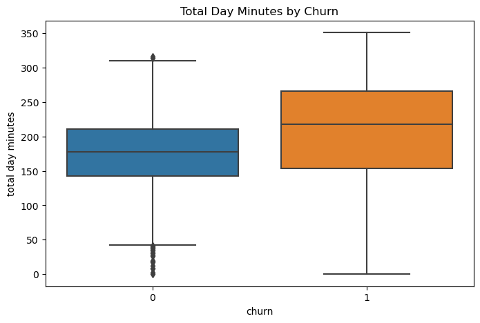

## CUSTOMER CHURN IN TELECOMMUNICATION COMPANY-SyriaTel

### Business Understanding
Our client a telecommunication company would like to be able to reduce the amount of money they loose by the customers that drop off from their services. This project will help to come up with an approrpriate that could predict any patterns of a client churning.

### Exploratory Data Analysis
1. Distribution of churn

2. Number of customers on international plan

3.Total Day Minutes by Day
