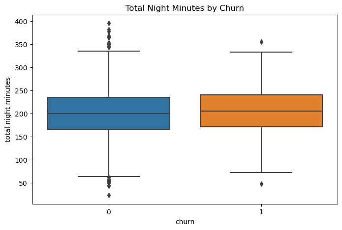
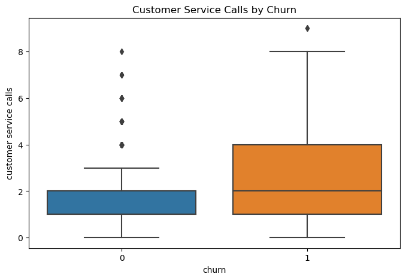
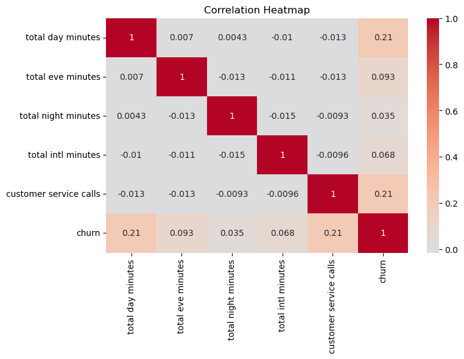
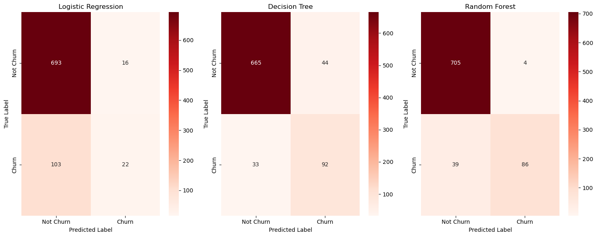

## CUSTOMER CHURN IN TELECOMMUNICATION COMPANY-SyriaTel

### Business Understanding
Our client a telecommunication company would like to be able to reduce the amount of money they loose by the customers that drop off from their services. This project will help to come up with an approrpriate that could predict any patterns of a client churning.

### Data Understanding
The dataset is from SyrialTel,a commmunication company. The data set is found in kaggle `https://www.kaggle.com/datasets/becksddf/churn-in-telecoms-dataset`
The dataset contains information of various users on the the type of calls they made,the duration of the calls,the number of calls,the cost of the calls and whether the customer churned or not.

### Exploratory Data Analysis

1. Distribution of churn

2. Number of customers on international plan

3. Total Day Minutes by churn

4.Total Night Minutes by churn 

5. Customer service calls by churn

6.Correlation between total day minutes,total evening minutes,total night minutes,total international minutes,customer service calls and churn

### Modeling
We picked three classification models that we would evaluate and pick the most accurate to be able to predict possibility of a customer churn.
* Logistic Regression
* Decision Tree
* Random Forest

Confusion Matrices for the three models

### Evaluation
We trained the data on a train set and tested the data on a test set and evaluated the models topick the most accurate. We used the following metrics;
* Precision
* Recall
* Accuracy
* F1 Score

### Conclusion and Recommendation
Random Forest is the best model considering the need to predict churn (Class 1) because it has:

* The highest F1-score for Class 1, which means it balances precision and recall well.
* The highest precision for Class 1, which ensures that when it predicts churn, it is most accurate.
